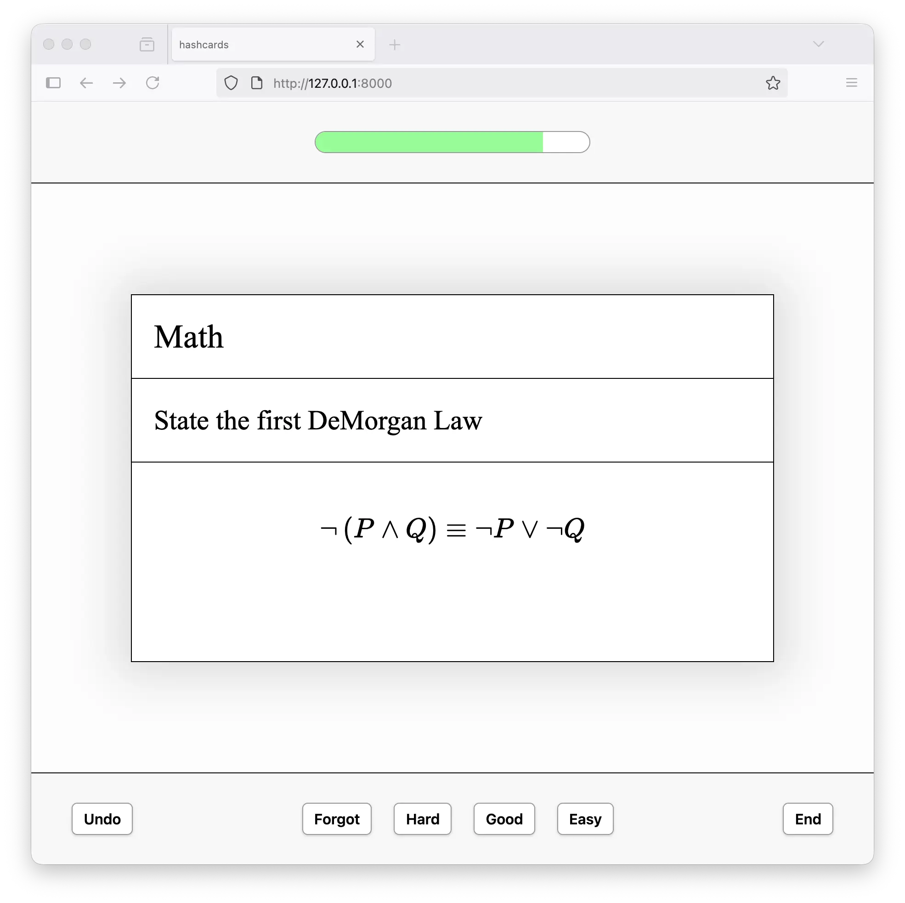

# hashcards

[](https://github.com/eudoxia0/hashcards/actions/workflows/test.yaml)
[](https://codecov.io/gh/eudoxia0/hashcards)



A plain text-based spaced repetition system. Features:

- **Plain Text:** all your flashcards are stored as plain text files, so you can operate on them with standard tools, write with your editor of choice, and track changes in a VCS.
- **Content Addressable:** cards are identified by the hash of their text. This means a card's progress is reset when the card is edited.
- **Low Friction:** you create flashcards by typing into a text file, using a lightweight notation to denote flashcard sides and cloze deletions.
- **Simple:** the only card types are front-back and cloze cards. More complex workflows (e.g.: Anki-style note types, card templates, automation) be can implemented using a Makefile and some scripts.

## Example

The following Markdown file is a valid hashcards deck:

```
Q: What is the capital of France?
A: Paris

C: [Paris] is the capital of [France].
```

## Building

You need [cargo] installed. You can get it through [rustup]. Then:

```
$ git clone https://github.com/eudoxia0/hashcards.git
$ cd hashcards
$ make
$ sudo make install
```

To drill flashcards in a directory, run:

```
$ hashcards drill $DIRNAME
```

## Format

This section describes the text format used by hashcards.

### Basic Cards

Question-answer flashcards are written like this:

```
Q: What is the order of a group?
A: The cardinality of its underlying set.
```

Both the question and the answer can span multiple lines:

```
Q: List the PGM minerals.
A:

- ruthenium
- rhodium
- palladium
- osmium
- iridium
- platinum
```

### Cloze Cards

Cloze cards start with the `C:` tag, and use square brackets to denote cloze deletions:

```
C: The [order] of a group is [the cardinality of its underlying set].
```

Again, cloze cards can span multiple lines:

```
C:
Better is the sight of the eyes than the wandering of the
desire: this is also vanity and vexation of spirit.

— [Ecclesiastes] [6]:[9]
```

## Prior Art

- [org-fc](https://github.com/l3kn/org-fc)
- [org-drill](https://orgmode.org/worg/org-contrib/org-drill.html)
- [hascard](https://hackage.haskell.org/package/hascard)
- [carddown](https://github.com/martintrojer/carddown)

[cargo]: https://doc.rust-lang.org/cargo/
[rustup]: https://rustup.rs/
